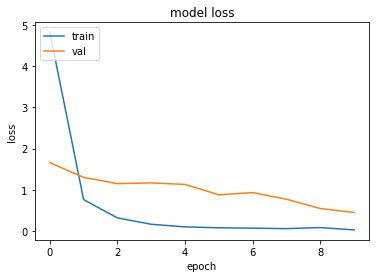

# Emotion-Classification-using-SVM-and-Neural-Networks

This repository contains two different approaches
1. Facial Emotion classification using Linear SVM and Landmark detector
2. Facial Emotion classification using CNN

## Linear SVM and Landmark detector

1. Data Used: Cohn-Kanade Images (The data is no longer open sourced)
2. Landmark Extraction : CV2 Landmark Detector Download https://github.com/italojs/facial-landmarks-recognition/blob/master/shape_predictor_68_face_landmarks.dat
3. Model Used for training : Support Vector Machine

First Images are passed to CV2 landmark detector to extract the landmarks from the face. 
Then these landmarks extracted from the images are passed to SUpport vector machine. 
The image is classified in to  one of the following labels ['anger' 'contempt' 'disgust' 'fear' 'happy' 'sadness' 'surprise']

Grid Search Parameters used:
C, Gamma, Kernel
Achiieved the test score of 95%
[[71  0  0  0  1  0  0] 
 [ 0 16  0  0  0  1  0] 
 [ 0  0 48  1  0  1  0] 
 [ 0  0  0 25  0  0  0] 
 [ 0  0  0  0 85  0  0] 
 [ 0  0  0  2  0 35  0] 
 [ 0  0  0  1  0  1 82]] 
             <pre>               precision    recall  f1-score   support

           1       1.00      0.99      0.99        72
           2       1.00      0.94      0.97        17
           3       1.00      0.96      0.98        50
           4       0.86      1.00      0.93        25
           5       0.99      1.00      0.99        85
           6       0.92      0.95      0.93        37
           7       1.00      0.98      0.99        84

    accuracy                           0.98       370
   macro avg       0.97      0.97      0.97       370
weighted avg       0.98      0.98      0.98       370
</pre>
### I have also written script to test the model on live video .

## CNN

1. Data Used: Cohn-Kanade Images
2. Frontal Face Extraction : CV2 Face Detector
3. Model Used for training : CNN

Data size : 3017, Input size : (60, 60, 3)

First Images are passed to CV2 Face detector to extract the frontal face 
Then these  cropped facial images are passed to Support vector machine and the small sized cropped faces are reshaped/interpolated. 
The image is classified in to  one of the following labels ['anger' 'contempt' 'disgust' 'fear' 'happy' 'sadness' 'surprise']

1. Weight Initalizer : Xavier/Glorot
2. Loss: Categorical class entropy since it is Multi Class Classification
3. Optimizer : Adam
4. Trained for 10 Epochs

